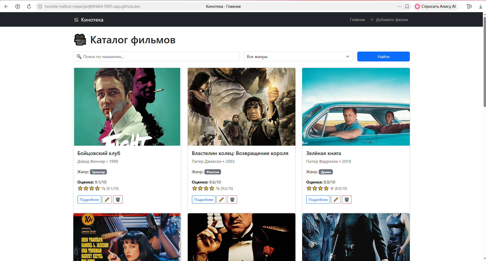

# Кинотека — каталог фильмов с оценками

Простое веб-приложение на Flask, в котором можно хранить список фильмов, ставить оценки от 1 до 10, искать по названию и фильтровать по жанру.

## 📌 Возможности

- просмотр всех фильмов в виде карточек
- добавление нового фильма (название, режиссёр, год, жанр, оценка, описание, постер)
- детальная страница каждого фильма
- редактирование и удаление фильмов
- поиск по названию
- фильтр по жанру
- оценка от 1 до 10 (можно с десятыми, например 7,5)
- автоматическое добавление тестовых фильмов при первом запуске

## 🚀 Запуск проекта

1. Скачай или склонируй репозиторий

2. Установи зависимости

pip install -r requirements.txt
Запусти приложение

python app.py
Открой в браузере

http://127.0.0.1:5000

🧪 Запуск тестов
bash
pytest tests/ -v
Будут запущены 5 автоматических тестов:

главная страница (200)

добавление фильма

поиск / фильтрация

обработка 404 ошибки

проверка валидации (пустое название)

🖼 Тестовые данные
При первом запуске база данных автоматически заполняется 10 фильмами:

Побег из Шоушенка

Крёстный отец

Тёмный рыцарь

Криминальное чтиво

Властелин колец: Возвращение короля

Матрица

Форрест Гамп

Бойцовский клуб

Начало

Зелёная книга

У каждого фильма есть:

краткое описание

ссылка на постер (рабочая)

оценка от 8,9 до 9,8

Если нужно очистить базу и начать с нуля:

bash
rm movies.db
python app.py
🧱 Технологии
Python 3

Flask

SQLite

Bootstrap 5

pytest

📁 Структура проекта

movie_catalog/
├── app.py
├── models.py
├── seed.py
├── requirements.txt
├── README.md
├── docs/
│   ├── requirements.md
│   ├── user_guide.md
│   └── architecture.md
├── tests/
│   └── test_app.py
└── templates/
    ├── base.html
    ├── index.html
    ├── detail.html
    ├── add.html
    ├── edit.html
    └── 404.html

📸 Скриншот

👤 Автор
Студент: Муллакаев Марат
Группа: ИС-201
Дисциплина: Технологии разработки ПО
## Автор: Студент
